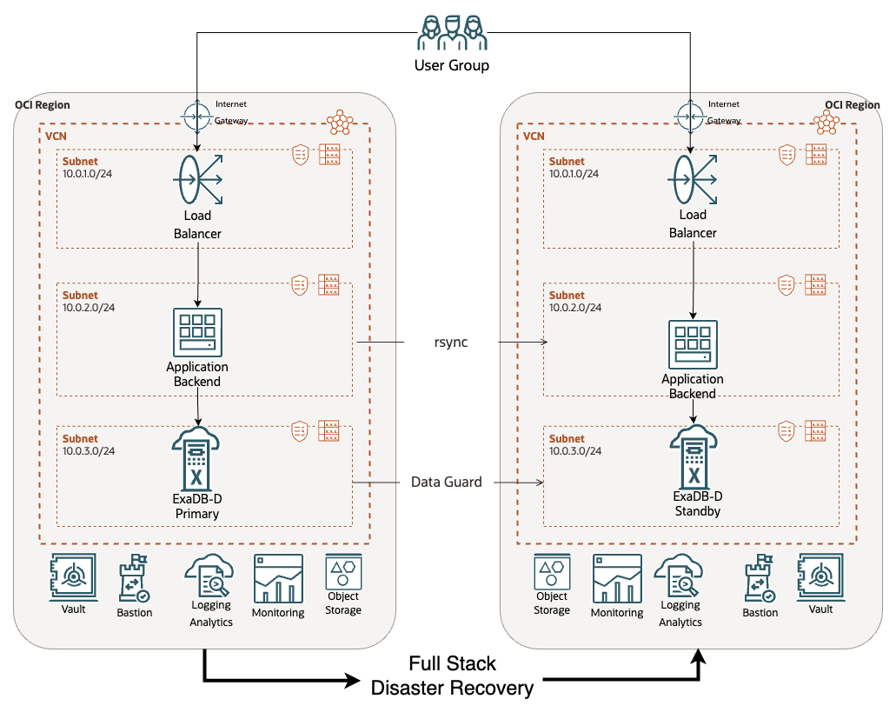

# OCI Full Stack Disaster Recovery

> This Solution Playbook is a WORK IN PROGRESS

Oracle Cloud Infrastructure (OCI) [Full Stack Disaster Recovery](https://www.oracle.com/cloud/full-stack-disaster-recovery/) orchestrates the transition of compute, database, and applications between OCI regions from around the globe with a single click.

## Introduction and Architecture

Businesses with existing applications using Oracle Database Cloud Services to create a Disaster Recovery plan with OCI Full Stack Disaster Recovery (FSDR).

The example is an Active-Pasive DR.

The application is composed of an **Oracle Exadata Database Dedicated** a **Java REST API** exposed through a **Load Balancer**.



For details check [NOTES](NOTES.md)

## TODO list

- Load Balancers
- Java App (start and stop)
- Rsync
- Include constant synthetic workload
- Oracle Database
- Data Guard
- Include OCI Vault secret for Oracle Database
- Include OCI Notification and OCI Events to get notified by email on switchover/failover

## Build Application

```bash
cd src/backend
```

```bash
./gradlew clean bootJar
```

```bash
cd ../..
```

## Deploy solution

Answer all the questions from `setenv.mjs` script:

```bash
zx scripts/setenv.mjs
```

Generate the `terraform.tfvars` file:

```bash
zx scripts/tfvars.mjs
```

Change to the terraform folder:

```bash
cd deploy/tf
```

Terraform init:

```bash
terraform init
```

Terraform Apply:

> Auto approve only for demo porpoise. Otherwise, use Terraform `plan`.

```bash
terraform apply -auto-approve
```

Come back to the root folder

```bash
cd ../..
```

## Run Disaster Recovery

This project uses K6 to test the deployment.

To Install K6 follow this link [Get Started > Installation](https://k6.io/docs/get-started/installation/).

```bash
k6 run client/request.js
```

## Clean up

Change to the terraform folder:

```bash
cd deploy/tf
```

Terraform destroy:

> Auto approve only for demo porpoise.

```bash
terraform destroy -auto-approve
```

Come back to the root folder

```bash
cd ../..
```

To clean config files and auxiliary files (SSH keys, certificates, etc):

```bash
zx scripts/clean.mjs
```
