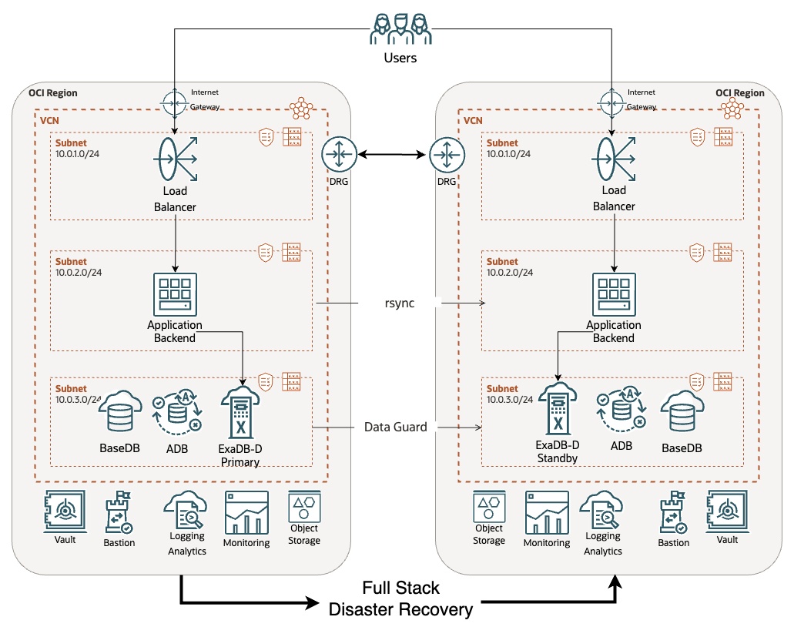

# OCI Full Stack Disaster Recovery

> This Proof of Concept is a WORK IN PROGRESS

Oracle Cloud Infrastructure (OCI) [Full Stack Disaster Recovery](https://www.oracle.com/cloud/full-stack-disaster-recovery/) orchestrates the transition of compute, database, and applications between OCI regions from around the globe with a single click.

## Introduction and Architecture

Businesses with existing applications using Oracle Database Cloud Services to create a Disaster Recovery plan with OCI Full Stack Disaster Recovery (FSDR).

The application is a Java middleware exposing a REST API exposed through a Load Balancer and Oracle Exadata Database Dedicated.



## Deploy solution

Answer all the questions from `setenv.mjs` script:

```
zx scripts/setenv.mjs
```

Generate the `terraform.tfvars` file:

```
zx scripts/tfvars.mjs
```

## Clean up

To clean config files and auxiliary files (SSH keys, certificates, etc):

```
zx scripts/clean.mjs
```
